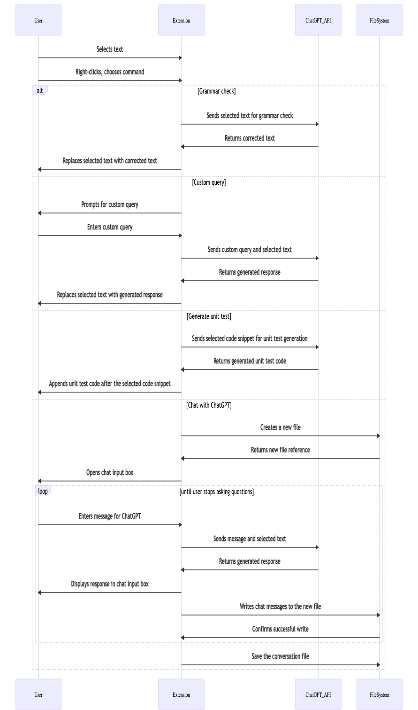

# ChatGPT-VSC

ChatGPT-VSC is a Visual Studio Code extension that integrates OpenAI GPT into your editor to help with grammar correction, code snippets, custom queries, and generating unit tests.

[](https://www.youtube.com/watch?v=1Hj7P0RO6jo)

## Features

- Grammar check: Select a piece of text and run the "ChatGPT Grammar Check" command to correct grammar and polish the text.
- Custom code generation: Select a piece of code or just run the "ChatGPT Custom Query" command to generate code based on your custom query.
- Unit test generation: Select a piece of code and run the "ChatGPT Generate Unit Test" command to generate unit tests for the selected code.
- Chat with GPT: Run the "ChatGPT Chat" command to have a conversation with GPT in a new markdown file, where you can ask questions or get help on various topics.
- Recover Chat with GPT: Open a previously saved ChatGPT conversation in Markdown format and run the "ChatGPT Recover Chat" command to recover and continue the conversation.

## Requirements

To use this extension, you need an OpenAI API key. You can obtain an API key from the [OpenAI website](https://platform.openai.com/account/api-keys).

## Extension Settings

This extension contributes the following configuration settings:

```json
{
  "chatgpt-vsc.apiKey": "Your OpenAI API key",
  "chatgpt-vsc.model": "GPT model to use (e.g., 'gpt-3.5-turbo' or 'gpt-3.5-turbo-0301')",
  "chatgpt-vsc.temperature": "Temperature for the model (e.g., 0.7)",
  "chatgpt-vsc.maxTokens": "Maximum number of tokens in the generated response (e.g., 2000)",
  "chatgpt-vsc.topP": "Top-p sampling for the model (e.g., 1)",
  "chatgpt-vsc.frequencyPenalty": "Frequency penalty for the model (e.g., 1.3)",
  "chatgpt-vsc.presencePenalty": "Presence penalty for the model (e.g., 1.3)"
}
```

## Usage

You can access the extension's commands by:

- Right-clicking in the editor and selecting the desired command from the context menu.
- Using the default keybinding for the "ChatGPT Grammar Check" command: `Shift+Ctrl+'` (Windows/Linux) or `Shift+Cmd+'` (Mac).
- Running the command from the Command Palette (Ctrl+Shift+P or Cmd+Shift+P) and searching for the desired command.

Note: For the "Generate unit test" command, it's important to select the entire code snippet for which you want to generate unit tests.

## Sequence Diagram


