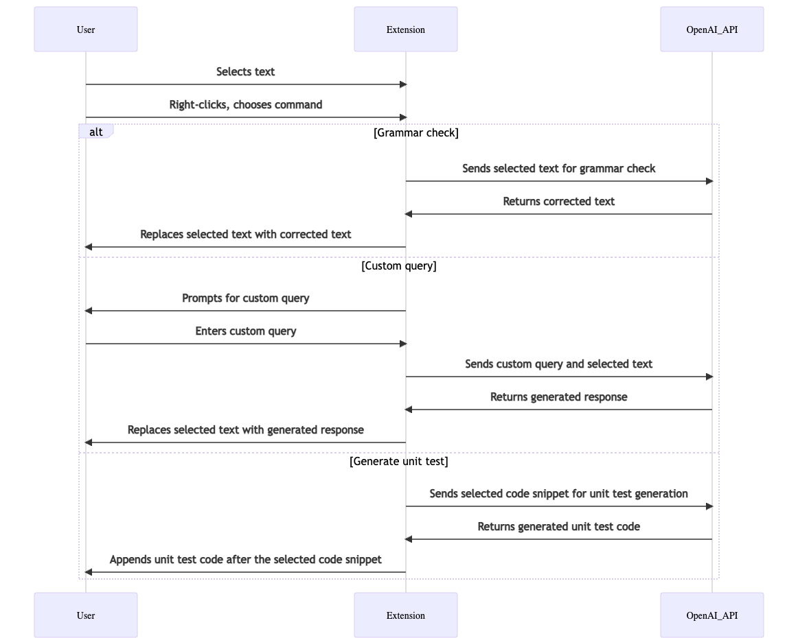

# ChatGPT-VSC

ChatGPT-VSC is a Visual Studio Code extension that integrates OpenAI GPT into your editor to help with grammar correction, code snippets, custom queries, and generating unit tests.

[](https://www.youtube.com/watch?v=1Hj7P0RO6jo)

## Features

- Correct grammar and polish selected text using the ChatGPT model
- Generate code snippets based on custom queries
- Replace the selected text with the generated response
- Generate unit test code for the selected code snippet

## Requirements

To use this extension, you need an OpenAI API key. You can obtain an API key from the [OpenAI website](https://platform.openai.com/account/api-keys).

## Extension Settings

This extension contributes the following configuration settings:

```json
{
  "chatgpt-vsc.apiKey": "Your OpenAI API key",
  "chatgpt-vsc.model": "GPT model to use (e.g., 'gpt-3.5-turbo' or 'gpt-3.5-turbo-0301')",
  "chatgpt-vsc.temperature": "Temperature for the model (e.g., 0.7)",
  "chatgpt-vsc.maxTokens": "Maximum number of tokens in the generated response (e.g., 2000)",
  "chatgpt-vsc.topP": "Top-p sampling for the model (e.g., 1)",
  "chatgpt-vsc.frequencyPenalty": "Frequency penalty for the model (e.g., 1.3)",
  "chatgpt-vsc.presencePenalty": "Presence penalty for the model (e.g., 1.3)"
}
```

## Usage

To use this extension, follow these steps:

### Grammar check

1. Select some text in the editor.
2. Right-click on the selected text to open the context menu. Click on the "ChatGPT Grammar Check" command or use the keyboard shortcut "shift+cmd+'" to call the OpenAI GPT model with the selected text as input.
3. The selected text will be replaced with the corrected text.

### Custom query

1. Select some text in the editor.
2. Right-click on the selected text to open the context menu. Click on the "ChatGPT Custom Query" command.
3. A prompt will appear asking for your custom query. Enter your query and press Enter.
4. The selected text will be replaced with the generated response based on your custom query.

### Generate unit test

1. Select a code snippet in the editor.
2. Right-click on the selected code to open the context menu. Click on the "ChatGPT Generate Unit Test" command.
3. The generated unit test code will be appended after the selected code snippet.

Note: For the "Generate unit test" command, it's important to select the entire code snippet for which you want to generate unit tests.

## Sequence Diagram


